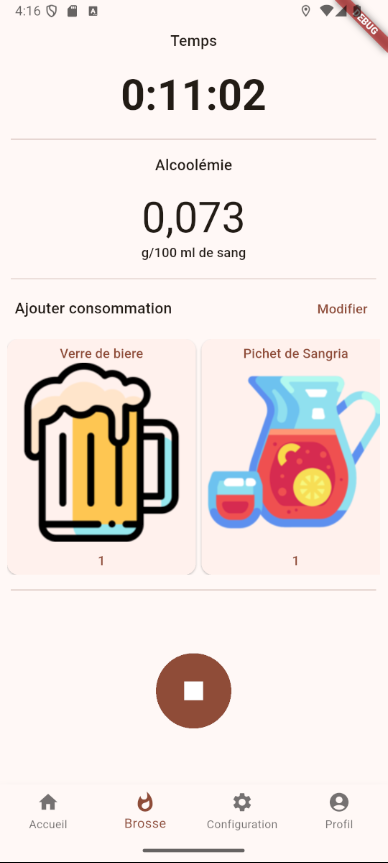
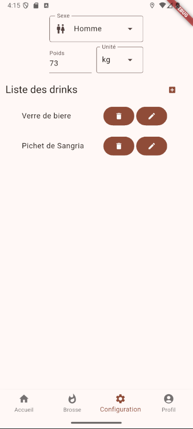

# Strôva

## Estimateur d'alcoolémie

    
    

## Permissions (Android)
- Détail de l'appli -> Notifications -> Toutes les notifications + Autoriser la pastille de notification
- Détails de l'appli -> Autorisations -> Localisation -> Toujours autoriser
